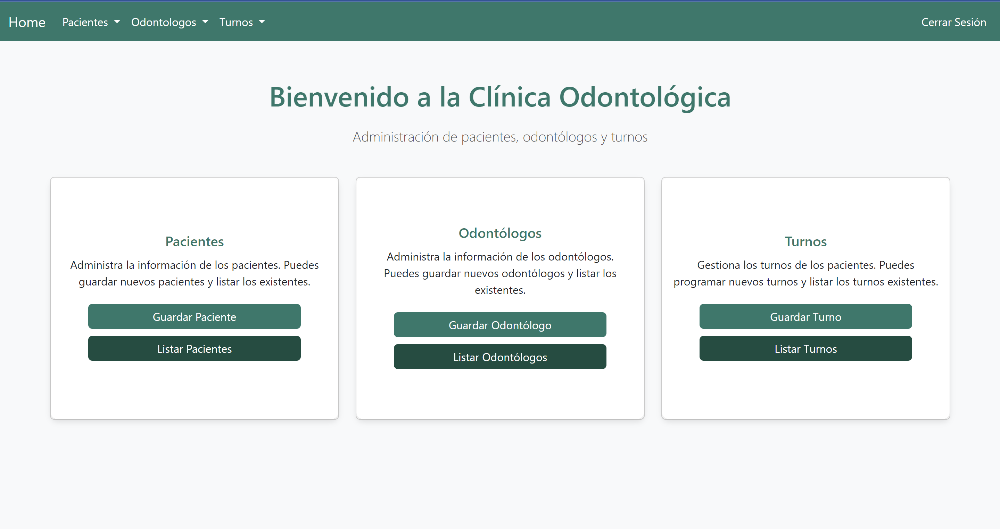

# Dental Clinic Management System

## Table of contents

- [Overview](#overview)
    - [The challenge](#the-challenge)
    - [Screenshot](#screenshot)
- [My process](#my-process)
    - [Built with](#built-with)
    - [What I learned](#what-i-learned)
    - [Continued development](#continued-development)
- [Author](#author)

## Overview

This project is a web application designed to manage the records of a dental clinic, including patient management, dentist information, and appointment scheduling.

### The challenge

Users (administrators) should be able to:

- Add, update, and delete patient records
- Manage dentist information and availability
- Schedule and view appointments for patients
- Securely log in with role-based access control

### Screenshot

## My process

### Built with

- HTML
- CSS
- JavaScript
- jQuery library
- Bootstrap 5
- Spring Boot
- Spring Security
- H2 Database

### What I learned

On this project, I learned how to implement a full-fledged CRUD application with Spring Boot and manage role-based authentication using Spring Security.

### Continued development

Future development could include integrating a more robust database like MySQL or PostgreSQL, expanding the appointment scheduling features, and adding a patient portal where patients can view their own records and appointments.

## Author

Luis David Jimenez Martinez
- Portfolio - [www.luisdavidjm.com](https://www.luisdavidjm.com)
- GitHub - [LuisDavidJM](https://github.com/LuisDavidJM)
